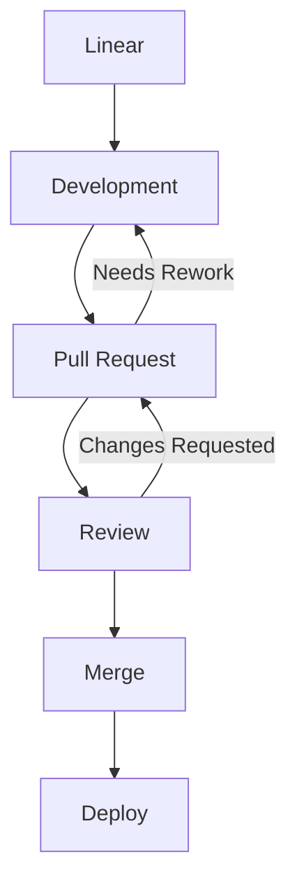

# GitHub-Flavored Markdown + HTML Workshop (Caseform)

# Why Markdown + HTML?

  * Structured PR comments
  * Clear GitHub Discussionsz
  * Enhanced READMEs and documentation

> Tip: Good formatting reduces reviewer fatigue. ✅

---

# PR Review Examples

### Markdown Example

```markdown
### Suggested Changes
- [ ] Rename `token` → `sessionToken` /* clearer meaning */
- [ ] Add null-payload test /* covers mobile client edge case */

<details>
<summary>Reasoning</summary>
The naming aligns with our auth service conventions.
</details>
```

**Rendered Result:**

### Suggested Changes

* [ ] Rename `token` → `sessionToken` /* clearer meaning */
* [ ] Add null-payload test /* covers mobile client edge case */

<details>
<summary>Reasoning</summary>
The naming aligns with our auth service conventions.
</details>

---

# Tables

### Markdown Table

```markdown
| Endpoint        | Expected | Actual |
|-----------------|----------|--------|
| POST /session   | 200 OK   | 200 OK |
| DELETE /session | 204 OK   | 500 ❌ |
```

**Rendered Result:**

| Endpoint        | Expected | Actual |
| --------------- | -------- | ------ |
| POST /session   | 200 OK   | 200 OK |
| DELETE /session | 204 OK   | 500 ❌  |

### HTML Table

> [!TIP]
> All tags available for use inside Markdown files can be found [here](https://github.com/gjtorikian/html-pipeline/blob/main/lib/html_pipeline/sanitization_filter.rb).

```html
<table>
  <tr><th>Endpoint</th><th>Expected</th><th>Actual</th></tr>
  <tr><td>POST /session</td><td>200 OK</td><td>200 OK</td></tr>
  <tr><td>DELETE /session</td><td>204 OK</td><td>500 ❌</td></tr>
</table>
```

**Rendered Result:**

<table>
  <tr><th>Endpoint</th><th>Expected</th><th>Actual</th></tr>
  <tr><td>POST /session</td><td>200 OK</td><td>200 OK</td></tr>
  <tr><td>DELETE /session</td><td>204 OK</td><td>500 ❌</td></tr>
</table>

---

# Collapsibles & Spoilers

```markdown
<details>
  <summary>Edge Cases</summary>
  - Token expired > 12h
  - Mobile retries 3×
</details>
```

**Rendered Result:**

<details>
<summary>Edge Cases</summary>
- Token expired > 12h
- Mobile retries 3×
</details>

---

# Code Blocks & Inline Comments

<pre>```javascript
// Example Caseform logic
if (!sessionToken) {
  throw new Error("missing session token"); /* reject unauthorized */
}
```</pre>

**Rendered Result:**

```javascript
// Example Caseform logic
if (!sessionToken) {
  throw new Error("missing session token"); /* reject unauthorized */
}
```

---

## Notes / Info

---

> [!NOTE]
> Useful information that users should know, even when skimming content.

> [!TIP]
> Helpful advice for doing things better or more easily.

> [!IMPORTANT]
> Key information users need to know to achieve their goal.

> [!WARNING]
> Urgent info that needs immediate user attention to avoid problems.

> [!CAUTION]
> Advises about risks or negative outcomes of certain actions.

---

# GitHub Discussions

```markdown
## Action Items
- [ ] Investigate cold-start latency /* backend lambdas */
- [ ] Document retry strategy /* client SDK */
- [ ] Align error schema /* API consistency */

@alice Can you verify logging behavior?
```

**Rendered Result:**

## Action Items

* [ ] Investigate cold-start latency /* backend lambdas */
* [ ] Document retry strategy /* client SDK */
* [ ] Align error schema /* API consistency */

@alice Can you verify logging behavior?

---

# Mermaid Diagrams
<pre> ```mermaid 
  flowchart TD 
  %% Main workflow 
  A[Linear] --> B[Development] 
  B --> C[Pull Request] 
  C --> D[Review]
  D --> E[Merge]
  E --> F[Deploy]
  %% Backflow from Review 
  D -->|Changes Requested| C 
  C -->|Needs Rework| B 
 ``` </pre>

**Rendered Result:**


---

# Footnotes

```markdown
Some flows rely on OAuth2[^1].

[^1]: https://oauth.net/2/
```

**Rendered Result:**

Some flows rely on OAuth2[^1].

[^1]: [https://oauth.net/2/](https://oauth.net/2/)

---

# Task Lists

```markdown
- [ ] Investigate performance
- [x] Update README
- [ ] Review PR
```

**Rendered Result:**

* [ ] Investigate performance
* [x] Update README
* [ ] Review PR

---

# Blockquotes & Emojis

```markdown
> Remember: clarity is key! 🚀
```

**Rendered Result:**

> Remember: clarity is key! 🚀

---

# Live Workshop Section

* Enhance a Caseform PR review using Markdown + HTML
* Improve a GitHub Discussion
* Update a README section
* Apply task lists, tables, collapsibles, footnotes, and Mermaid diagrams

---

# Summary

* Markdown = simple, fast
* HTML = powerful, flexible
* Combining both → best results in GitHub
* Fully supports Caseform workflow

# ICD Search Engine <sup>[✨](#footnote-1)</sup>

A tiny service for lightning-fast searches across ICD-10 codes — with paging, multi-language support, Dockerized deployment, and simple configuration.

---

## Goal

> Quickly and efficiently search ICD-10<abbr title="International Classification of Diseases, 10th Revision">¹⁰</abbr> codes and descriptions.
> Works for English, German, and Spanish datasets.

---

## How to Run It

> **Pro-tip:** ensure your Node.js version matches `package.json` — tools like `nvm` or `nvm-windows` save lives.

### Installation

```
npm install
```

### ▶ Development mode

```
npm start
```

### Production mode

```
npm run production
```

---

## API Usage

```
GET|POST /search/<language>/<page>/<page_size>/<search_term>
```

### Examples

> *(These are real ICD-10 codes — yes, “sucked into jet engine” is a thing.)*

#### Full-text search by **code**

`GET http://localhost:5000/search/en/0/10/V9733XD`

```json
{
  "results": { "V9733XD ": "Sucked into jet engine, subsequent encounter" },
  "total_elements": 1
}
```

#### Full-text search by **text**

`GET http://localhost:5000/search/en/0/10/Spacecraft%20crash%20injuring%20occupant`

```json
{
  "results": {
    "V9541XA ": "Spacecraft crash injuring occupant, initial encounter",
    "V9541XD ": "Spacecraft crash injuring occupant, subsequent encounter",
    "V9541XS ": "Spacecraft crash injuring occupant, sequela"
  },
  "total_elements": 3
}
```

#### Paging

`GET /search/en/0/2/V9107X`

```json
{
  "results": {
    "V9107XA ": "Burn due to water-skis on fire, initial encounter",
    "V9107XD ": "Burn due to water-skis on fire, subsequent encounter"
  },
  "total_elements": 3
}
```

`GET /search/en/2/1/V9107X`

```json
{
  "results": {
    "V9107XS ": "Burn due to water-skis on fire, sequela"
  },
  "total_elements": 3
}
```

---

## Advanced Usage

### Production-like execution

Sometimes bugs only show up outside dev mode. Here’s a ladder of “more production-ish” environments:

1. Run in Docker (recommended)
2. Use a production Node environment
3. Deploy behind your reverse proxy of choice

---

### Docker

<details>
<summary><strong>Show Docker instructions</strong></summary>

#### Build image

```
docker build . --tag icdlocal0
```

#### Run container

```
docker run -p 5000:5000 -it icdlocal0
```

</details>

---

## ⚙ Configuration

Copy the example file and adjust values:

```
cp .env.example .env
```

You may configure:

| Setting      | Meaning                           |
| ------------ | --------------------------------- |
| `PORT`       | Port the server listens on        |
| `HOST`       | Host binding (e.g., 0.0.0.0)      |
| `DEBUG`      | Enable verbose logging            |
| `SENTRY_DSN` | Sentry error reporting (optional) |

---

## ‍ Editing the Code

Use any editor you like — VS Code, NeoVim, JetBrains, Sublime, or Notepad.exe if you’re feeling dangerous.

---

## Configuration Data

`config.yml` contains:

| Key   | Description                    |
| ----- | ------------------------------ |
| host  | Server hostname                |
| port  | Port where service runs        |
| debug | Boolean debug flag             |
| paths | Where ICD-10 files are located |

---

## ICD-10 Data

Sources (official):

* **ES**: Spanish dataset
* **DE**: German dataset
* **EN**: English dataset

> **Spoiler:** The format is extremely simple.

<details>
<summary><strong>Show data format</strong></summary>

Each file must have **two UTF-8 columns**:

| id    | description                                        |
| ----- | -------------------------------------------------- |
| A000  | Cholera due to Vibrio cholerae 01, biovar cholerae |
| A001  | Cholera due to Vibrio cholerae 01, biovar eltor    |
| A009  | Cholera, unspecified                               |
| A0100 | Typhoid fever, unspecified                         |
| A0101 | Typhoid meningitis                                 |
| ...   | ...                                                |

</details>

> ⚠ **Note:** Use **UTF-8** when pasting data — this prevents corrupted German characters (e.g., “Ä”, “Ö”, “Ü”).

---

## Footnotes

<a id="footnote-1">**[1]**</a> Fancy footnote demonstrating advanced Markdown.

