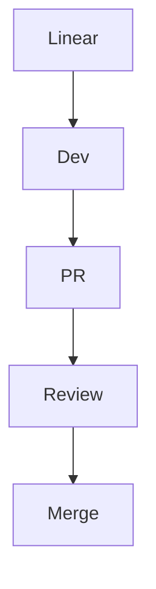

# GitHub-Flavored Markdown + HTML Workshop (Caseform)

This is a **single Markdown file** containing the entire presentation, examples, and code snippets. You can view it as one continuous document.

---

# Slide 1 — Title

# **Markdown + HTML Workshop**

### Caseform

* Examples first
* Then live session
* Focused on our workflow

---

# Slide 2 — Why Markdown + HTML?

* Works perfectly with GitHub PR Reviews
* Our workflow:

  * Linear → Dev → PR → Review → Merge
* PR descriptions optional → formatting still matters
* Markdown + HTML help us:

  * Structure review comments
  * Keep discussions readable
  * Improve documentation (READMEs)

---

# Slide 3 — PR Review Comment (Markdown)

```markdown
### Suggested Changes
- [ ] Rename `token` → `sessionToken` /* clearer meaning */
- [ ] Add null-payload test /* covers mobile client edge case */

<details>
<summary>Reasoning</summary>
The naming aligns with our auth service conventions.
</details>
```

---

# Slide 4 — PR Review Comment (HTML)

```html
<h3>Suggested Changes</h3>
<ul>
  <li><input type="checkbox"> Rename <code>token</code> → <code>sessionToken</code> <!-- consistent naming --></li>
  <li><input type="checkbox"> Add null payload test <!-- backend mobile interaction --></li>
</ul>
<details>
  <summary>Reasoning</summary>
  Aligns with our service-level naming.
</details>
```

---

# Slide 5 — Tables (Markdown)

```markdown
| Endpoint        | Expected | Actual |
|-----------------|----------|--------|
| POST /session   | 200 OK   | 200 OK |
| DELETE /session | 204 OK   | 500 ❌ |
```

---

# Slide 6 — Tables (HTML)

```html
<table>
  <tr><th>Endpoint</th><th>Expected</th><th>Actual</th></tr>
  <tr><td>POST /session</td><td>200 OK</td><td>200 OK</td></tr>
  <tr><td>DELETE /session</td><td>204 OK</td><td>500 ❌</td></tr>
</table>
```

---

# Slide 7 — Collapsibles (Both)

```markdown
<details>
  <summary>Edge Cases</summary>
  - Token expired > 12h
  - Mobile retries 3×
</details>
```

```html
<details>
  <summary>Edge Cases</summary>
  <ul>
    <li>Token expired &gt; 12h <!-- backend rejects token --></li>
    <li>Mobile retries 3× <!-- app-side retry loop --></li>
  </ul>
</details>
```

---

# Slide 8 — Code Blocks Example

```javascript
// Example Caseform logic
if (!sessionToken) {
  throw new Error("missing session token"); /* reject unauthorized */
}
```

---

# Slide 9 — Mermaid Workflow Diagram



---

# Slide 10 — GitHub Discussion Example

```markdown
## Action Items
- [ ] Investigate cold-start latency /* backend lambdas */
- [ ] Document retry strategy /* client SDK */
- [ ] Align error schema /* API consistency */

@alice Can you verify logging behavior?
```

---

# Slide 11 — Mixed Markdown & HTML

```markdown
## Auth Summary
<table>
  <tr><td>Step</td><td>Description</td></tr>
  <tr><td>1</td><td>Client requests token</td></tr>
  <tr><td>2</td><td>Server validates</td></tr>
  <tr><td>3</td><td>Token returned</td></tr>
</table>
```

---

# Slide 12 — Live Session

* Enhance a real Caseform PR review using MD + HTML
* Improve one GitHub Discussion
* Update a README section

---

# Slide 13 — Summary

* Markdown = simple, fast
* HTML = powerful, flexible
* Combining both → best results in GitHub
* Directly supports Caseform workflow
