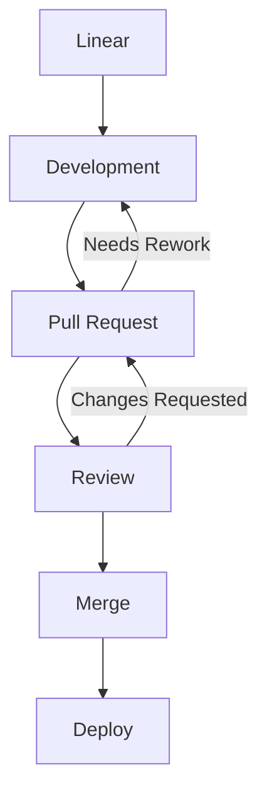
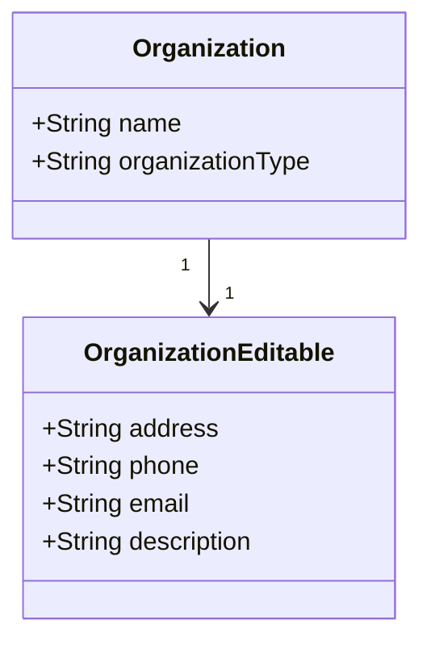
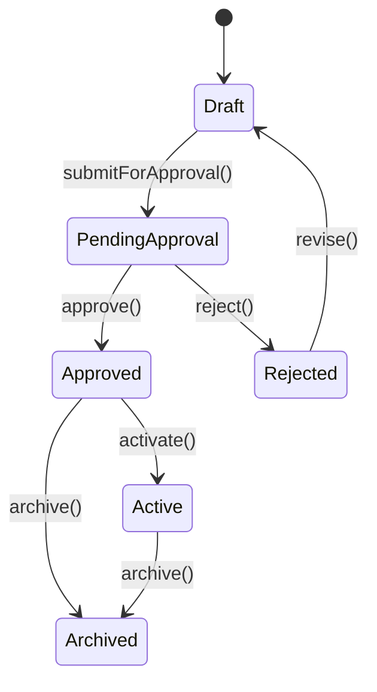

# GitHub-Flavored Markdown + HTML Workshop (Caseform)

# Why Markdown + HTML?

  * Structured PR comments
  * Clear GitHub Discussionsz
  * Enhanced READMEs and documentation

> Tip: Good formatting reduces reviewer fatigue. ✅

---

# Tables

### Markdown Table

```markdown
| Endpoint        | Expected | Actual |
|-----------------|----------|--------|
| POST /session   | 200 OK   | 200 OK |
| DELETE /session | 204 OK   | 500 ❌ |
```

**Rendered Result:**

| Endpoint        | Expected | Actual |
| --------------- | -------: | ------ |
| POST /session   | 200 OK   | 200 OK |
| DELETE /session | 204 OK   | 500 ❌  |

### Aligment in markdown Table

```markdown
| Left-aligned (e.g. text)     | Center-aligned (e.g. labels) | Right-aligned (e.g. numbers) |
|:-----------------------------|:----------------------------:|-----------------------------:|
| normal text                  | **CANCLED**                  |                      1234.56 |
| longer sentence here         | **ACTIVE**                   |                        98765 |
| file name.md                 | **PENDING**                  |                           42 |

```

**Rendered Result:**

| Left-aligned (e.g. text)     | Center-aligned (e.g. labels) | Right-aligned (e.g. numbers) |
|:-----------------------------|:----------------------------:|-----------------------------:|
| normal text                  | **CANCLED**                  |                      1234.56 |
| longer sentence here         | **ACTIVE**                   |                        98765 |
| file name.md                 | **PENDING**                  |                           42 |

### HTML Table

> [!IMPORTANT]
> All HTML tags available for use inside Markdown files can be found [here](https://github.com/gjtorikian/html-pipeline/blob/main/lib/html_pipeline/sanitization_filter.rb).

```html
<table>
  <tr><th>Endpoint</th><th>Expected</th><th>Actual</th></tr>
  <tr><td>POST /session</td><td>200 OK</td><td>200 OK</td></tr>
  <tr><td>DELETE /session</td><td>204 OK</td><td>500 ❌</td></tr>
</table>
```

**Rendered Result:**

<table>
  <tr><th>Endpoint</th><th>Expected</th><th>Actual</th></tr>
  <tr><td>POST /session</td><td>200 OK</td><td>200 OK</td></tr>
  <tr><td>DELETE /session</td><td>204 OK</td><td>500 ❌</td></tr>
</table>

### Multi-row or multi-column cells (using HTML)

```html
<table>
  <tr><th colspan="2">Header</th></tr>
  <tr>
    <td rowspan="2">A</td>
    <td>B1</td>
  </tr>
  <tr>
    <td>B2</td>
  </tr>
</table>
```

**Rendered Result:**

<table>
  <tr><th colspan="2">Header</th></tr>
  <tr>
    <td rowspan="2">A</td>
    <td>B1</td>
  </tr>
  <tr>
    <td>B2</td>
  </tr>
</table>

> [!TIP]
> You can use [online generators](https://www.tablesgenerator.com/markdown_tables) for creating both html and markdown tables.

---

# Collapsibles & Spoilers

### Simple example of Collapsible
```markdown
<details> 
<summary>▶ Edge Cases </summary> 

- Token expired > 12h 
- Mobile retries 3×

</details>
```

**Rendered Result:**

<details> 
<summary>▶ Edge Cases </summary> 

- Token expired > 12h 
- Mobile retries 3×

</details>

### Nesting collapsibles

```markdown
<details>
<summary>📘 API Documentation</summary>

This section provides reference info for the `/users` API.

---

<details>
<summary>📊 Endpoint Overview</summary>

| Field        | Description                      | Example            |
|:-------------|:----------------------------------|:-------------------|
| Method       | HTTP verb used                    | GET                |
| Path         | Request path                      | `/api/users`       |
| Auth         | Authentication required?          | Yes                |
| Rate Limit   | Max requests per minute           | 60                 |
| Returns      | JSON array of user objects        | `[ {…}, {…} ]`     |

</details>

---

<details>
<summary>💻 Example Request</summary>

```bash
curl -X GET https://api.example.com/users \
  -H "Authorization: Bearer <token>"
`` `
</details> 
</details>

```

**Rendered Result:**

<details>
<summary>📘 API Documentation</summary>

This section provides reference info for the `/users` API.

---

<details>
<summary>📊 Endpoint Overview</summary>

| Field        | Description                      | Example            |
|:-------------|:----------------------------------|:-------------------|
| Method       | HTTP verb used                    | GET                |
| Path         | Request path                      | `/api/users`       |
| Auth         | Authentication required?          | Yes                |
| Rate Limit   | Max requests per minute           | 60                 |
| Returns      | JSON array of user objects        | `[ {…}, {…} ]`     |

</details>

---

<details>
<summary>💻 Example Request</summary>

```bash
curl -X GET https://api.example.com/users \
  -H "Authorization: Bearer <token>"
```
</details> 
</details>

---

# Code Blocks & Inline Comments

<pre>```javascript
// Example Caseform logic
if (!sessionToken) {
  throw new Error("missing session token"); /* reject unauthorized */
}
```</pre>

**Rendered Result:**

```javascript
// Example Caseform logic
if (!sessionToken) {
  throw new Error("missing session token"); /* reject unauthorized */
}
```

---

## Notes / Info

---

> [!NOTE]
> Useful information that users should know, even when skimming content.

> [!TIP]
> Helpful advice for doing things better or more easily.

> [!IMPORTANT]
> Key information users need to know to achieve their goal.

> [!WARNING]
> Urgent info that needs immediate user attention to avoid problems.

> [!CAUTION]
> Advises about risks or negative outcomes of certain actions.

---

# GitHub Discussions

```markdown
## Action Items
- [ ] Investigate cold-start latency /* backend lambdas */
- [ ] Document retry strategy /* client SDK */
- [ ] Align error schema /* API consistency */

@alice Can you verify logging behavior?
```

**Rendered Result:**

## Action Items

* [ ] Investigate cold-start latency /* backend lambdas */
* [ ] Document retry strategy /* client SDK */
* [ ] Align error schema /* API consistency */

@alice Can you verify logging behavior?

---

# Mermaid Diagrams
<pre> ```mermaid 
  flowchart TD 
  %% Main workflow 
  A[Linear] --> B[Development] 
  B --> C[Pull Request] 
  C --> D[Review]
  D --> E[Merge]
  E --> F[Deploy]
  %% Backflow from Review 
  D -->|Changes Requested| C 
  C -->|Needs Rework| B 
 ``` </pre>

**Rendered Result:**

# Mermaid Class Diagrams
<pre>

</pre>

**Rendered Result:**

# Mermaid State diagram
<pre>

</pre>
**Rendered Result:**

---

# Footnotes

```markdown
Some flows rely on OAuth2[^1].

[^1]: https://oauth.net/2/
```

**Rendered Result:**

Some flows rely on OAuth2[^1].

[^1]: [https://oauth.net/2/](https://oauth.net/2/)

---

# Task Lists

```markdown
- [ ] Investigate performance
- [x] Update README
- [ ] Review PR
```

**Rendered Result:**

* [ ] Investigate performance
* [x] Update README
* [ ] Review PR

---

# Blockquotes & Emojis

```markdown
> Remember: clarity is key! 🚀
```

**Rendered Result:**

> Remember: clarity is key! 🚀

---

# Live Workshop Section

* Enhance a Caseform PR review using Markdown + HTML
* Improve a GitHub Discussion
* Update a README section
* Apply task lists, tables, collapsibles, footnotes, and Mermaid diagrams

---

# Summary

* Markdown = simple, fast
* HTML = powerful, flexible
* Combining both → best results in GitHub
* Fully supports Caseform workflow

