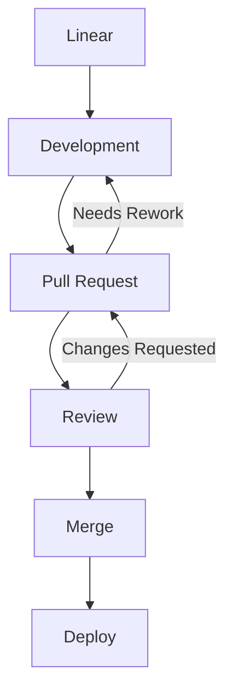

# GitHub-Flavored Markdown + HTML Workshop (Caseform)

A complete, ready-to-use Markdown file showcasing **all possibilities** of GitHub-Flavored Markdown with examples, HTML, code snippets, and rendered results below each snippet.

---

# Why Markdown + HTML?

  * Structured PR comments
  * Clear GitHub Discussions
  * Enhanced READMEs and documentation

> Tip: Good formatting reduces reviewer fatigue. ✅

---

# PR Review Examples

### Markdown Example

```markdown
### Suggested Changes
- [ ] Rename `token` → `sessionToken` /* clearer meaning */
- [ ] Add null-payload test /* covers mobile client edge case */

<details>
<summary>Reasoning</summary>
The naming aligns with our auth service conventions.
</details>
```

**Rendered Result:**

### Suggested Changes

* [ ] Rename `token` → `sessionToken` /* clearer meaning */
* [ ] Add null-payload test /* covers mobile client edge case */

<details>
<summary>Reasoning</summary>
The naming aligns with our auth service conventions.
</details>

---

# Tables

### Markdown Table

```markdown
| Endpoint        | Expected | Actual |
|-----------------|----------|--------|
| POST /session   | 200 OK   | 200 OK |
| DELETE /session | 204 OK   | 500 ❌ |
```

**Rendered Result:**

| Endpoint        | Expected | Actual |
| --------------- | -------- | ------ |
| POST /session   | 200 OK   | 200 OK |
| DELETE /session | 204 OK   | 500 ❌  |

### HTML Table

```html
<table>
  <tr><th>Endpoint</th><th>Expected</th><th>Actual</th></tr>
  <tr><td>POST /session</td><td>200 OK</td><td>200 OK</td></tr>
  <tr><td>DELETE /session</td><td>204 OK</td><td>500 ❌</td></tr>
</table>
```

**Rendered Result:**

<table>
  <tr><th>Endpoint</th><th>Expected</th><th>Actual</th></tr>
  <tr><td>POST /session</td><td>200 OK</td><td>200 OK</td></tr>
  <tr><td>DELETE /session</td><td>204 OK</td><td>500 ❌</td></tr>
</table>

---

# Collapsibles & Spoilers

```markdown
<details>
  <summary>Edge Cases</summary>
  - Token expired > 12h
  - Mobile retries 3×
</details>
```

**Rendered Result:**

<details>
<summary>Edge Cases</summary>
- Token expired > 12h
- Mobile retries 3×
</details>

---

# Code Blocks & Inline Comments

```javascript
// Example Caseform logic
if (!sessionToken) {
  throw new Error("missing session token"); /* reject unauthorized */
}
```

**Rendered Result:**

// Example Caseform logic
if (!sessionToken) {
throw new Error("missing session token"); /* reject unauthorized */
}

---

## Notes / Info

---

> [!NOTE]
> Useful information that users should know, even when skimming content.

> [!TIP]
> Helpful advice for doing things better or more easily.

> [!IMPORTANT]
> Key information users need to know to achieve their goal.

> [!WARNING]
> Urgent info that needs immediate user attention to avoid problems.

> [!CAUTION]
> Advises about risks or negative outcomes of certain actions.

---

# GitHub Discussions

```markdown
## Action Items
- [ ] Investigate cold-start latency /* backend lambdas */
- [ ] Document retry strategy /* client SDK */
- [ ] Align error schema /* API consistency */

@alice Can you verify logging behavior?
```

**Rendered Result:**

## Action Items

* [ ] Investigate cold-start latency /* backend lambdas */
* [ ] Document retry strategy /* client SDK */
* [ ] Align error schema /* API consistency */

@alice Can you verify logging behavior?

---

# Mermaid Diagrams
<pre> ```mermaid 
  flowchart TD 
  %% Main workflow 
  A[Linear] --> B[Development] 
  B --> C[Pull Request] 
  C --> D[Review]
  D --> E[Merge]
  E --> F[Deploy]
  %% Backflow from Review 
  D -->|Changes Requested| C 
  C -->|Needs Rework| B 
 ``` </pre>

**Rendered Result:**


---

# Footnotes

```markdown
Some flows rely on OAuth2[^1].

[^1]: https://oauth.net/2/
```

**Rendered Result:**

Some flows rely on OAuth2[^1].

[^1]: [https://oauth.net/2/](https://oauth.net/2/)

---

# Task Lists

```markdown
- [ ] Investigate performance
- [x] Update README
- [ ] Review PR
```

**Rendered Result:**

* [ ] Investigate performance
* [x] Update README
* [ ] Review PR

---

# Blockquotes & Emojis

```markdown
> Remember: clarity is key! 🚀
```

**Rendered Result:**

> Remember: clarity is key! 🚀

---

# Live Workshop Section

* Enhance a Caseform PR review using Markdown + HTML
* Improve a GitHub Discussion
* Update a README section
* Apply task lists, tables, collapsibles, footnotes, and Mermaid diagrams

---

# Summary

* Markdown = simple, fast
* HTML = powerful, flexible
* Combining both → best results in GitHub
* Fully supports Caseform workflow


# Onboarding / Role Update Checklist for New Experienced Developer

### GitHub Teams
- Add them to **Caseform** team
- Remove them from **Caseform (non-reviewers)** team

### TMetric
- Add them as **Team Lead** in **Caseform (Experienced)** team

### Quick Reference / Initials
- Update **Quick Reference** page: move/add their initials

### Slack
- Add them to **@caseform-experienced** user group

### Refinement / Meetings
- Create **Refinement in Progress** section for them
- Update **Controlling spreadsheet**:
  - Set them as next **Refinement Speaker**
  - Add them to **SSE rotation** (re-randomize twice)

### Documentation
- Send them the link to [What are my duties, rights, and responsibilities as experienced developer and refinement speaker?](https://github.com/Caseform/repo/issues/1215)  
      Ask them to read it at their earliest convenience
