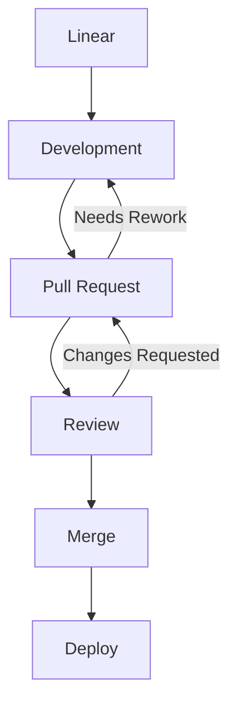

# GitHub-Flavored Markdown + HTML Workshop (Caseform)

# Why Markdown + HTML?

  * Structured PR comments
  * Clear GitHub Discussionsz
  * Enhanced READMEs and documentation

> Tip: Good formatting reduces reviewer fatigue. ✅

---

# PR Review Examples

### Markdown Example

```markdown
### Suggested Changes
- [ ] Rename `token` → `sessionToken` /* clearer meaning */
- [ ] Add null-payload test /* covers mobile client edge case */

<details>
<summary>Reasoning</summary>
The naming aligns with our auth service conventions.
</details>
```

**Rendered Result:**

### Suggested Changes

* [ ] Rename `token` → `sessionToken` /* clearer meaning */
* [ ] Add null-payload test /* covers mobile client edge case */

<details>
<summary>Reasoning</summary>
The naming aligns with our auth service conventions.
</details>

---

# Tables

### Markdown Table

```markdown
| Endpoint        | Expected | Actual |
|-----------------|----------|--------|
| POST /session   | 200 OK   | 200 OK |
| DELETE /session | 204 OK   | 500 ❌ |
```

**Rendered Result:**

| Endpoint        | Expected | Actual |
| --------------- | -------- | ------ |
| POST /session   | 200 OK   | 200 OK |
| DELETE /session | 204 OK   | 500 ❌  |

### HTML Table

```html
<table>
  <tr><th>Endpoint</th><th>Expected</th><th>Actual</th></tr>
  <tr><td>POST /session</td><td>200 OK</td><td>200 OK</td></tr>
  <tr><td>DELETE /session</td><td>204 OK</td><td>500 ❌</td></tr>
</table>
```

**Rendered Result:**

<table>
  <tr><th>Endpoint</th><th>Expected</th><th>Actual</th></tr>
  <tr><td>POST /session</td><td>200 OK</td><td>200 OK</td></tr>
  <tr><td>DELETE /session</td><td>204 OK</td><td>500 ❌</td></tr>
</table>

---

# Collapsibles & Spoilers

```markdown
<details>
  <summary>Edge Cases</summary>
  - Token expired > 12h
  - Mobile retries 3×
</details>
```

**Rendered Result:**

<details>
<summary>Edge Cases</summary>
- Token expired > 12h
- Mobile retries 3×
</details>

---

# Code Blocks & Inline Comments

```javascript
// Example Caseform logic
if (!sessionToken) {
  throw new Error("missing session token"); /* reject unauthorized */
}
```

**Rendered Result:**

// Example Caseform logic
if (!sessionToken) {
throw new Error("missing session token"); /* reject unauthorized */
}

---

## Notes / Info

---

> [!NOTE]
> Useful information that users should know, even when skimming content.

> [!TIP]
> Helpful advice for doing things better or more easily.

> [!IMPORTANT]
> Key information users need to know to achieve their goal.

> [!WARNING]
> Urgent info that needs immediate user attention to avoid problems.

> [!CAUTION]
> Advises about risks or negative outcomes of certain actions.

---

# GitHub Discussions

```markdown
## Action Items
- [ ] Investigate cold-start latency /* backend lambdas */
- [ ] Document retry strategy /* client SDK */
- [ ] Align error schema /* API consistency */

@alice Can you verify logging behavior?
```

**Rendered Result:**

## Action Items

* [ ] Investigate cold-start latency /* backend lambdas */
* [ ] Document retry strategy /* client SDK */
* [ ] Align error schema /* API consistency */

@alice Can you verify logging behavior?

---

# Mermaid Diagrams
<pre> ```mermaid 
  flowchart TD 
  %% Main workflow 
  A[Linear] --> B[Development] 
  B --> C[Pull Request] 
  C --> D[Review]
  D --> E[Merge]
  E --> F[Deploy]
  %% Backflow from Review 
  D -->|Changes Requested| C 
  C -->|Needs Rework| B 
 ``` </pre>

**Rendered Result:**


---

# Footnotes

```markdown
Some flows rely on OAuth2[^1].

[^1]: https://oauth.net/2/
```

**Rendered Result:**

Some flows rely on OAuth2[^1].

[^1]: [https://oauth.net/2/](https://oauth.net/2/)

---

# Task Lists

```markdown
- [ ] Investigate performance
- [x] Update README
- [ ] Review PR
```

**Rendered Result:**

* [ ] Investigate performance
* [x] Update README
* [ ] Review PR

---

# Blockquotes & Emojis

```markdown
> Remember: clarity is key! 🚀
```

**Rendered Result:**

> Remember: clarity is key! 🚀

---

# Live Workshop Section

* Enhance a Caseform PR review using Markdown + HTML
* Improve a GitHub Discussion
* Update a README section
* Apply task lists, tables, collapsibles, footnotes, and Mermaid diagrams

---

# Summary

* Markdown = simple, fast
* HTML = powerful, flexible
* Combining both → best results in GitHub
* Fully supports Caseform workflow


# Onboarding / Role Update Checklist for New Experienced Developer

### GitHub Teams
- Add them to **Caseform** team
- Remove them from **Caseform (non-reviewers)** team

### TMetric
- Add them as **Team Lead** in **Caseform (Experienced)** team

### Quick Reference / Initials
- Update **Quick Reference** page: move/add their initials

### Slack
- Add them to **@caseform-experienced** user group

### Refinement / Meetings
- Create **Refinement in Progress** section for them
- Update **Controlling spreadsheet**:
  - Set them as next **Refinement Speaker**
  - Add them to **SSE rotation** (re-randomize twice)

### Documentation
- Send them the link to [What are my duties, rights, and responsibilities as experienced developer and refinement speaker?](https://github.com/Caseform/repo/issues/1215)  
      Ask them to read it at their earliest convenience

# frozen_string_literal: true

require "selma"

class HTMLPipeline
  # A special filter with sanization routines and allowlists. This module defines
  # what HTML is allowed in user provided content and fixes up issues with
  # unbalanced tags and whatnot.
  #
  # See the Selma docs for more information on the underlying library:
  #
  # https://github.com/gjtorikian/selma/#readme
  #
  # This filter does not write additional information to the context.
  class SanitizationFilter
    VALID_PROTOCOLS = Selma::Sanitizer::Config::VALID_PROTOCOLS.dup

    # The main sanitization allowlist. Only these elements and attributes are
    # allowed through by default.
    DEFAULT_CONFIG = Selma::Sanitizer::Config.freeze_config({
      elements: [
        "h1",
        "h2",
        "h3",
        "h4",
        "h5",
        "h6",
        "br",
        "b",
        "i",
        "strong",
        "em",
        "a",
        "pre",
        "code",
        "img",
        "tt",
        "div",
        "ins",
        "del",
        "sup",
        "sub",
        "p",
        "picture",
        "ol",
        "ul",
        "table",
        "thead",
        "tbody",
        "tfoot",
        "blockquote",
        "dl",
        "dt",
        "dd",
        "kbd",
        "q",
        "samp",
        "var",
        "hr",
        "ruby",
        "rt",
        "rp",
        "li",
        "tr",
        "td",
        "th",
        "s",
        "strike",
        "summary",
        "details",
        "caption",
        "figure",
        "figcaption",
        "abbr",
        "bdo",
        "cite",
        "dfn",
        "mark",
        "small",
        "source",
        "span",
        "time",
        "wbr",
      ],

      attributes: {
        "a" => ["href"],
        "img" => ["src", "longdesc", "loading", "alt"],
        "div" => ["itemscope", "itemtype"],
        "blockquote" => ["cite"],
        "del" => ["cite"],
        "ins" => ["cite"],
        "q" => ["cite"],
        "source" => ["srcset"],
        all: [
          "abbr",
          "accept",
          "accept-charset",
          "accesskey",
          "action",
          "align",
          "alt",
          "aria-describedby",
          "aria-hidden",
          "aria-label",
          "aria-labelledby",
          "axis",
          "border",
          "char",
          "charoff",
          "charset",
          "checked",
          "clear",
          "cols",
          "colspan",
          "compact",
          "coords",
          "datetime",
          "dir",
          "disabled",
          "enctype",
          "for",
          "frame",
          "headers",
          "height",
          "hreflang",
          "hspace",
          "id",
          "ismap",
          "label",
          "lang",
          "maxlength",
          "media",
          "method",
          "multiple",
          "name",
          "nohref",
          "noshade",
          "nowrap",
          "open",
          "progress",
          "prompt",
          "readonly",
          "rel",
          "rev",
          "role",
          "rows",
          "rowspan",
          "rules",
          "scope",
          "selected",
          "shape",
          "size",
          "span",
          "start",
          "summary",
          "tabindex",
          "title",
          "type",
          "usemap",
          "valign",
          "value",
          "width",
          "itemprop",
        ],
      },
      protocols: {
        "a" => { "href" => Selma::Sanitizer::Config::VALID_PROTOCOLS }.freeze,
        "blockquote" => { "cite" => ["http", "https", :relative].freeze },
        "del" => { "cite" => ["http", "https", :relative].freeze },
        "ins" => { "cite" => ["http", "https", :relative].freeze },
        "q" => { "cite" => ["http", "https", :relative].freeze },
        "img" => {
          "src" => ["http", "https", :relative].freeze,
          "longdesc" => ["http", "https", :relative].freeze,
        },
      },
    })

    class << self
      def call(html, config)
        raise ArgumentError, "html must be a String, not #{html.class}" unless html.is_a?(String)
        raise ArgumentError, "config must be a Hash, not #{config.class}" unless config.is_a?(Hash)

        sanitization_config = Selma::Sanitizer.new(config)
        Selma::Rewriter.new(sanitizer: sanitization_config).rewrite(html)
      end
    end
  end
end
